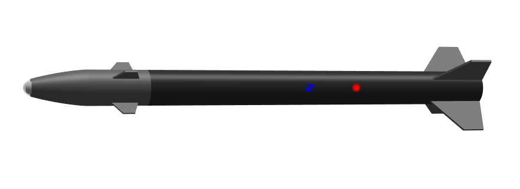

**Hyades Flight Computer**

Custom STM32H743 flight computer and GNC software for an actively roll-controlled high-power rocket.

This is an engineering project, not a product. The safety case, regulatory compliance, and airworthiness of any vehicle built from this material are the builder's sole responsibility.

**Project Progress**

| Feature                         | Status |
|---------------------------------|:------:|
| Flight Computer Design          | ✅ Complete |
| Flight Computer Testing         | 🚧 In Progress |
| Flight Software                 | 🚧 In Progress |
| Simulink Roll Model             | ✅ Complete |
| Simulink 6DOF Model             | ✅ Complete |
| MATLAB Monte Carlo Analysis     | ✅ Complete |
| MATLAB Gain Optimisation        | ✅ Complete |
| System Integration              | ⏳ Not Started |
| HITL Testing                    | ⏳ Not Started |
| Flight Testing                  | ⏳ Not Started |

**Flight Computer Design**

**Flight Computer Testing**

**Flight Software**

**Simulink Roll Model**

**Simulink 6DOF Model**

**MATLAB Monte Carlo Analysis**

**MATLAB Gain Optimisation**

**System Integration**

**HITL Testing**

**Flight Testing**
