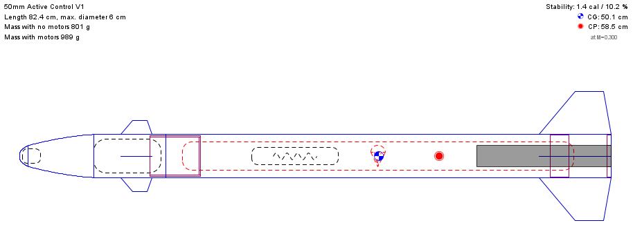
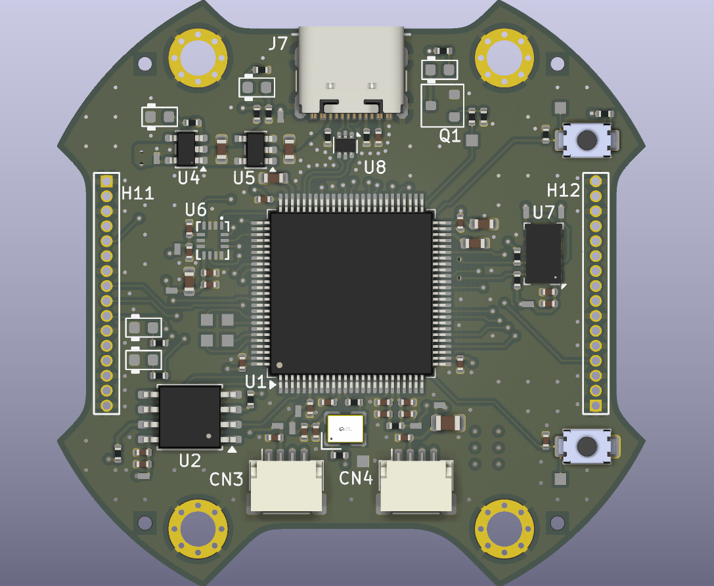
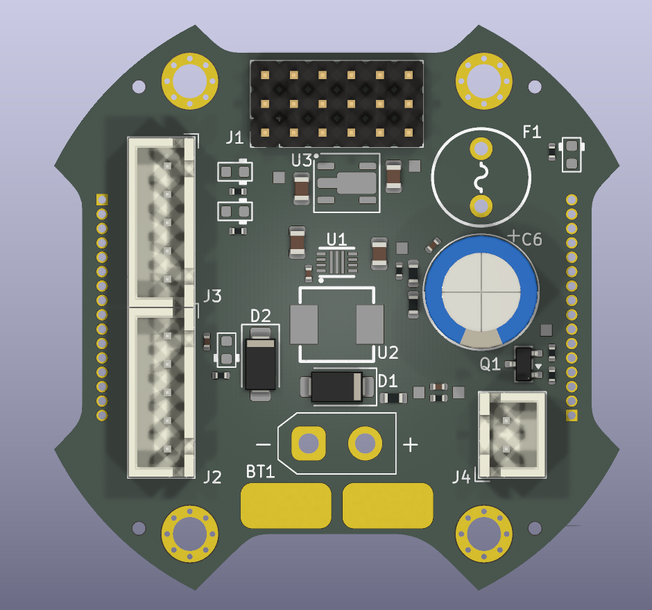
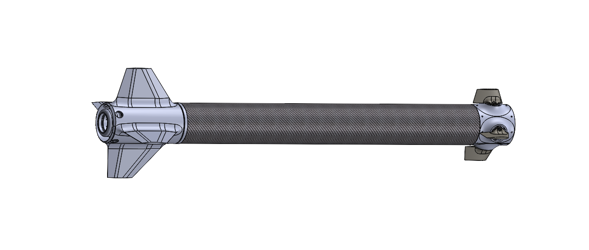
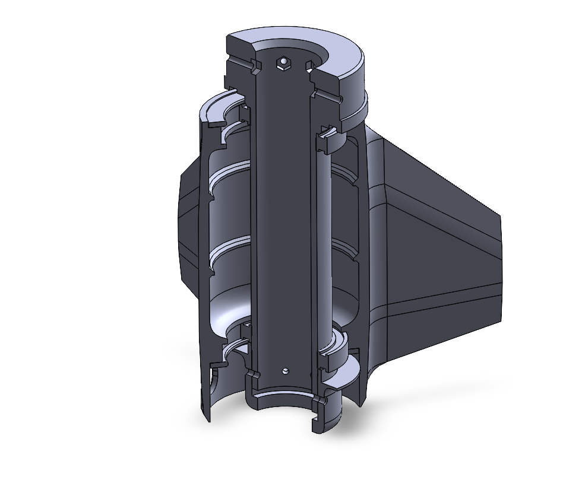
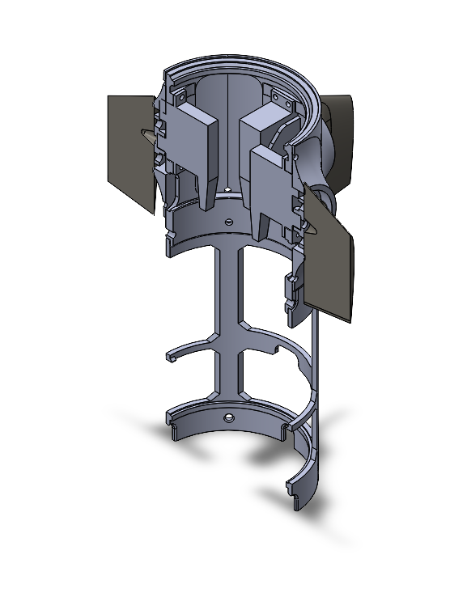

---

**Hyades Flight Computer**

Custom STM32H743 flight computer and GNC software for an actively roll-controlled high-power rocket.
*This is an engineering project, not a product. The safety case, regulatory compliance, and airworthiness of any vehicle built from this material are the builder's sole responsibility.*

The system is designed to provide:
- High sample rate inertial measurement and state estimation
- Real-time flight control
- 6 PWM servo connectors, currently with 4 being used for canard-based active roll stabilisation
- In flight data logging and optional in-flight telemetry

This repository contains the hardware design, embedded software, simulation models, and analysis tools used during development.

---

**Project Progress**

| Feature                         | Status |
|---------------------------------|:------:|
| Flight Computer Design          | ✅ Complete |
| Flight Computer Testing         | 🚧 In Progress |
| Flight Software                 | 🚧 In Progress |
| Flight Hardware Design          | 🚧 In Progress |
| Flight Hardware Testing         | 🚧 In Progress |
| Simulink Roll Model             | ✅ Complete |
| Simulink 6DOF Model             | ✅ Complete |
| MATLAB Monte Carlo Analysis     | ✅ Complete |
| MATLAB Gain Optimisation        | ✅ Complete |
| System Integration              | ⏳ Not Started |
| HITL Testing                    | ⏳ Not Started |
| Flight Testing                  | ⏳ Not Started |

---

**Flight Computer Design**

---

**Flight Computer Testing**

**Flight Hardware Design**

---

---

**Flight Hardware Testing**

**Flight Software**

**Simulink Roll Model**

**Simulink 6DOF Model**

**MATLAB Monte Carlo Analysis**

---

---

---

**MATLAB Gain Optimisation**

**System Integration**

**HITL Testing**

**Flight Testing**

